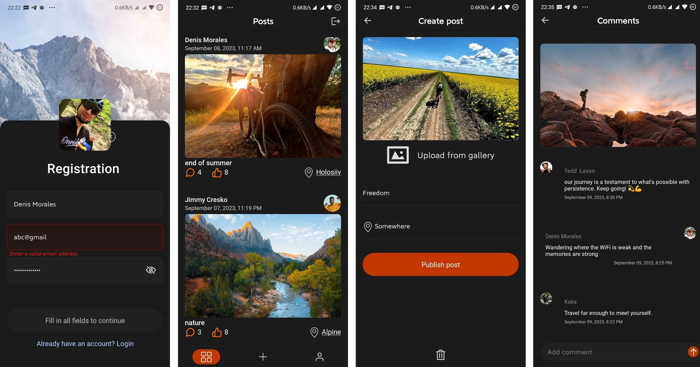

# 
React Native project

 
🤖 Open this link on your Android devices (or scan the QR code) to install the app

<a href='https://expo.dev/accounts/goodpointt/projects/AwesomeProject/builds/bdc03993-0eea-42d7-8e30-ca504f503de1'>Download ⬇️</a>

###

- [Figma maket](<https://www.figma.com/file/YqWLNarVE4x1zkXa6PYJfi/Homework-(Copy)-(Copy)?type=design&node-id=3-26>)
